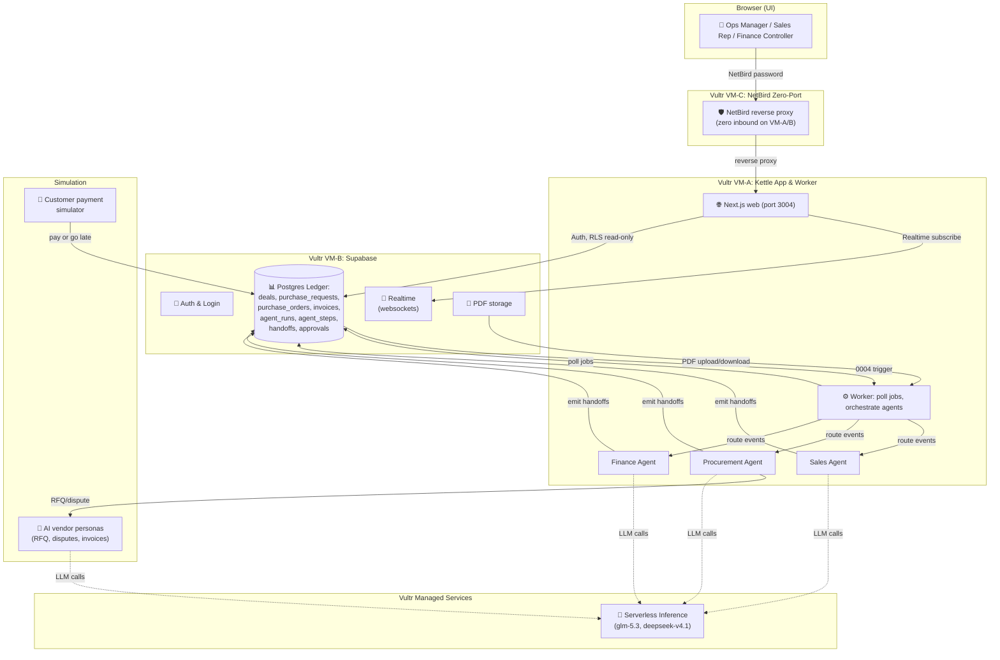

# Kettle: Enterprise Back-Office Orchestration with AI Agents

> *A kettle is a flock of vultures circling together.*

Kettle is a flock of AI agents (**Sales**, **Procurement**, and **Finance**) that run an enterprise's back office together on [Vultr](https://vultr.com). They share one ledger, hand work to each other, push back when something doesn't add up, and stop for human approval on anything that moves money.

**Every action is recorded in a live, auditable execution trail — not a static dashboard.** The goal is to show a pattern for agent-to-agent enterprise ops: how to build AI systems that are trustworthy, policy-gated, and coordinated at scale.

- **Live demo:** https://kettle.4625labs.com (Vultr-hosted)
- **Challenge:** Vultr Agent Arena 2026, Challenge 2 (Future of Work)
- **Requirements:** [`docs/REQUIREMENTS.md`](docs/REQUIREMENTS.md)
- **Architecture deep dive:** [`docs/ARCHITECTURE.md`](docs/ARCHITECTURE.md)
- **Demo script & checklist:** [`docs/DEMO.md`](docs/DEMO.md)

## The Problem

In mid-size companies, one customer order touches three separate teams with no shared system:

- **Sales** closes the deal in a CRM, then emails ops: "We need 200 units by Nov 15."
- **Procurement** re-keys that into a spreadsheet, emails three vendors for quotes, picks one, issues a PO.
- **Finance** receives the vendor invoice weeks later, hunts for the matching PO, discovers the price doesn't match, emails procurement, and separately chases the customer for payment.

Every handoff is manual, slow, and lossy. Mismatched invoices get paid. Customer invoices go out late. Nobody knows where an order is stuck.

## The Solution

Kettle runs a **multi-agent workflow** where:

1. **Sales Agent** validates a won deal and emits two handoffs: a purchase request to Procurement, and an invoice request to Finance.
2. **Procurement Agent** requests quotes from 3 simulated vendors, scores them, and issues a purchase order. Orders above a threshold require human approval.
3. **Finance Agent** issues the customer invoice and performs a **3-way match** (PO ↔ vendor invoice ↔ goods receipt). Mismatches are flagged and handed back to Procurement.
4. **The twist (demo "wow" moment):** The vendor overbills. Finance detects it, Procurement disputes it, the vendor corrects it, and Finance re-matches. All three lanes light up in the execution trail.
5. **Closing the loop:** Customer pays (or goes overdue). Deal shows fulfilled & collected.

All coordination happens through an **AI orchestrator** that routes events to the right agent, enforces an allow-list of actions, validates all outputs, and escalates to humans at approval gates. The result: auditable, policy-gated autonomy.

## Architecture at a Glance



## Stack

| Component | Tech | Why |
|-----------|------|-----|
| **Frontend & API** | Next.js 16, TypeScript | Modern React, App Router, type safety |
| **Database** | Supabase (Postgres) | Managed Postgres, Auth, Realtime subscriptions, RLS |
| **Data + Queuing** | Postgres tables + job queue | Single source of truth; no external message broker |
| **LLM inference** | Vultr Serverless Inference | OpenAI-compatible API, deterministic pricing |
| **Infra** | Vultr VMs + NetBird | VMs are the control plane; zero inbound ports via NetBird reverse proxy |
| **Real-time UI** | Supabase Realtime | Websockets to Postgres subscriptions; <1s UI updates |
| **Documents** | pdf-lib, pdftoppm, vision LLM | Generate vendor invoices; extract fields from PDFs via image input |

## Local Setup

### Prerequisites

- Node.js 20+
- Docker (for Supabase)
- Poppler (for PDF rendering): `brew install poppler` (macOS) or `apt-get install poppler-utils` (Linux)

### Installation

```bash
cd web

# Install dependencies
npm install

# Start local Supabase (creates a fresh Postgres, Auth, Realtime, Storage)
npx supabase start -x studio,logflare,vector,imgproxy,edge-runtime,supavisor,mailpit

# Apply the schema and seed data
npx supabase db reset

# Configure environment (copy the template)
cp .env.example .env.local
# Fill in:
# - SUPABASE_URL: http://localhost:54321 (from supabase start output)
# - SUPABASE_ANON_KEY: (from supabase start output)
# - VULTR_INFERENCE_API_KEY: (leave blank for local; or fill in if testing inference)
```

### Running

**Terminal 1: Next.js dev server**
```bash
npm run dev
# Opens http://localhost:3004
```

**Terminal 2: Agent worker**
```bash
npm run worker:dev
# Processes jobs, runs agents, orchestrates handoffs
```

**Terminal 3: Supabase**
```bash
npx supabase status
# Verify all services are running (should be from 'supabase start' above)
```

### Demo Users (Local Supabase)

```
Ops Manager:         ops@kettle.demo / kettle-demo
Sales Rep:           sales@kettle.demo / kettle-demo
Finance Controller:  finance@kettle.demo / kettle-demo
```

### Running Smoke Tests

```bash
# Start local Supabase and Next.js dev server (see above)

# In a new terminal:
npm test

# To run a specific test:
npm test -- smoke.spec.ts

# To run against deployed Vultr instance:
KETTLE_BASE_URL=https://kettle.4625labs.com npm test
# (You will need to provide NetBird password via env var or browser prompt)
```

## Deployed Status

The app is live on Vultr as of **2026-09-26**:

| VM | Role | IP | Status |
|----|------|----|----|
| **VM-A** | Next.js app + worker | 64.177.51.161 | ✅ Live, no inbound ports |
| **VM-B** | Supabase (Postgres, Auth, Realtime) | 96.30.205.155 | ✅ Healthy |
| **VM-C** | NetBird reverse proxy | 144.202.22.122 | ✅ Reverse-proxy only |

**Public URL:** https://kettle.4625labs.com (served via NetBird, zero open ports on app/db VMs)

### Demo Credentials

**Provided to judges separately** (not in git for security).

### Deployment Notes

- **Zero-port design (N1–N4):** No inbound ports on VM-A or VM-B; all traffic flows through NetBird reverse proxy on VM-C.
- **Per-run URLs (N4):** Each run gets an ephemeral, PIN-protected URL that expires when the run completes (~90 seconds after run end).
- **Health checks:** Regularly verified via VM-C dashboard and Realtime events.
- **Uptime:** VMs persist; data reset via `npm run demo:reset` in the worker.

For detailed infrastructure, see [`infra/README.md`](infra/README.md).

## What Was Built During the Event

**Requirement IDs** (see [`docs/REQUIREMENTS.md`](docs/REQUIREMENTS.md)):

| Category | What | Requirements |
|----------|------|---|
| **Sales Agent** | Create/validate deals, emit handoffs | S1–S3 ✅ |
| **Procurement Agent** | RFQ scoring, PO approval gates, dispute handling | P1–P5 ✅ |
| **Finance Agent** | Customer invoicing, 3-way match, invoice extraction via vision, payment gates | F1–F6 ✅ |
| **Coordination** | AI orchestrator, handoff routing, approval queue, ledger, escalation | K1–K6 ✅ |
| **Simulated World** | AI vendor personas, overbilling demo, PDF invoices, customer payment sim | W1–W5 ✅ |
| **Web App** | Real-time execution trail, approvals inbox, deal page, auth + roles | U1–U5 ✅ |
| **Zero-Port Bonus** | NetBird reverse proxy, zero inbound ports, per-run URLs | N1–N4 ✅ |

**Stretch goals completed:** K5 (idempotency), K6 (escalation), F5 (overdue follow-up).

## Project Structure

```
web/                       Next.js app (port 3004)
  src/
    app/                   App Router pages (run, approvals, deals, login)
    lib/
      agent/               AI orchestrator, sales/procurement/finance agents
      supabase/            Browser & server Supabase clients
      documents/           PDF generation & vision extraction
      sim-bridge.ts        Vendor personas & customer simulator
      contracts/           Handoff schemas & enums
  worker/                  Agent worker process (jobs, orchestration)
  supabase/                Migrations, seed data, auth policies
  tests/                   Playwright smoke tests
  playwright.config.ts     Test config

docs/
  REQUIREMENTS.md          Full spec & success criteria
  ARCHITECTURE.md          Agent design, handoffs, guardrails
  DEMO.md                  3-minute live demo script, video plan, Q&A
  STATUS.md                Current state, blockers, lessons learned
  TEST-PLAN.md             Manual test scenarios
  diagrams/                10 Mermaid architecture diagrams

infra/
  README.md                Vultr VM provisioning, NetBird setup
  Terraform/ansible        IaC for VMs and networking
```

## Key Decisions

1. **AI orchestrator vs state machine:** The model routes events to agents based on context, not a hardcoded graph. Agents can communicate flexibly (Sales → Procurement → Finance → back to Procurement on anomaly) without code changes.

2. **Vendor personas as AI agents:** Vendors respond to RFQs and disputes with AI-generated text, price variations within bounds, and overbilling triggers on command. This simulates real-world variation without flaky external APIs.

3. **Approval gates as first-class events:** When a human approves/rejects in the UI, a Postgres trigger (0004) enqueues an `approval.decided` job. The worker processes it just like any other handoff, so the same ledger & orchestration logic applies.

4. **Postgres as the queue:** A simple `claim_job()` poll loop (4 concurrent slots) replaces a message broker. Every state transition is a row in the ledger. The worker is stateless and replicable.

5. **Deterministic + LLM hybrid:** Numbers (prices, quantities) and matching logic are computed in code (deterministic, testable). LLM is used for reasoning (vendor scoring, anomaly detection, dispute drafting) and text generation (persona messages, invoice extraction).

## Contributing

- **Source of truth:** `docs/REQUIREMENTS.md` (requirement IDs like F2, K4).
- **Ground rules for agents:** `docs/agents/_ground-rules.md` (binding).
- **Commit format:** Reference requirement IDs. Example: `fix(F3): flag mismatched invoice amounts (tolerance 5%)`.
- **Tests:** `npm test` (Playwright) or `npm run eval -- --late` (end-to-end golden path).

## FAQ

**Q: Will this connect to real Salesforce / QuickBooks / email?**  
No, this is a proof of concept. External integrations (Salesforce, ERPs, email providers, payment rails) are simulated by AI personas and are explicitly out of scope (see non-goals in REQUIREMENTS.md). The architecture shows how agents would coordinate; connecting to real systems is future work.

**Q: What if the LLM is slow or returns garbage?**  
Agents have step limits and loop detection. If the LLM fails or gets stuck in a loop, the orchestrator escalates to a human (K6). For scoring and matching (where determinism matters), we use rule-based code; LLM is used for reasoning and text only.

**Q: Why is Supabase suitable for a real system?**  
For a real enterprise system, you'd want a separate ledger database (e.g., QuickBooks, SAP). Supabase here is stand-in for "our ledger"; what matters is the architecture (agents → orchestrator → one shared ledger) and the handoff protocol, which are framework-agnostic.

**Q: How do I reset the demo for a fresh run?**  
```bash
npm run demo:reset
# Truncates agent_runs, agent_steps, handoffs, approvals, invoices, etc.
# Re-applies seed data (customers, vendors, products, demo deal)
# Keeps user accounts intact
```

**Q: How long does a full run take?**  
Golden path: ~19 seconds (5 runs averaging 16 LLM calls each, 0 fallbacks). Real-world enterprise processes would be slower due to human approvals and external API latency.

## For Judges

- **Live demo:** https://kettle.4625labs.com
- **README setup:** Follow "Local Setup" above to run against local Supabase.
- **Test plan:** See [`docs/TEST-PLAN.md`](docs/TEST-PLAN.md) for 10 scenarios (access, happy path, anomaly, rejection, roles, etc.).
- **Smoke tests:** `npm test` (requires local Supabase running).
- **Demo script:** [`docs/DEMO.md`](docs/DEMO.md) (3 minutes, all beats covered).
- **Architecture:** [`docs/ARCHITECTURE.md`](docs/ARCHITECTURE.md) (agents, handoffs, orchestrator, guardrails).

---

**Built with:** Vultr Agent Arena 2026 · Challenge 2: Future of Work  
**Deadline:** 2026-09-27 12:00 PM PT
