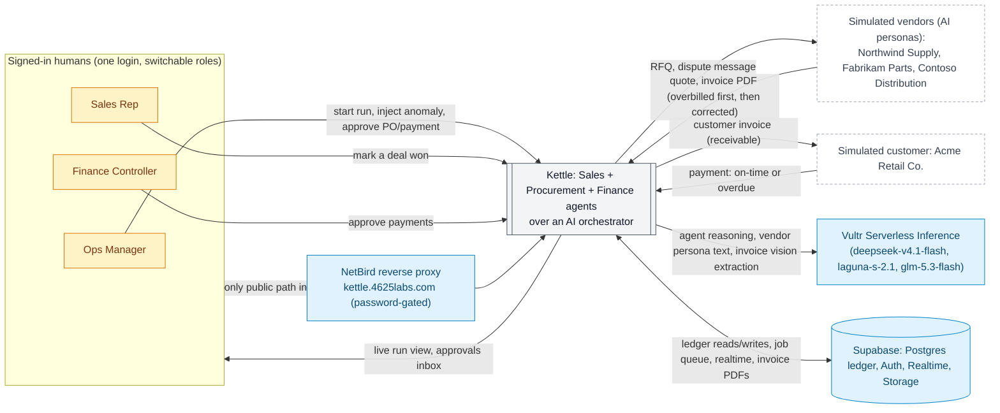

# System Context

**Question:** Who and what does Kettle interact with?

**How to read it:**
- Three humans (one seeded login, switchable role) drive Kettle by marking deals won and clearing approval gates; everything else the agents do themselves.
- Vendors and the customer are simulated: vendor personas are AI-played (bounded prices, untrusted text) and reply to RFQs, disputes, and invoices; the customer simulator pays on time or late.
- Every LLM call — agent reasoning, vendor persona text, invoice-image extraction — goes to Vultr Serverless Inference; no other AI provider is used.
- Supabase is the one shared ledger and also carries the job queue and realtime feed that makes the run view live.
- The public internet never reaches Kettle directly: NetBird's password-gated reverse proxy is the only way in (see `03-request-path.md`).

**Sources:** `docs/REQUIREMENTS.md` (§1-2, §5-6, §14), `docs/STATUS.md`, `web/supabase/seed.sql`, `web/src/lib/sim/personas.ts`, `web/src/lib/agent/inference.ts`, `web/src/lib/documents/vision.ts`, `infra/NETBIRD.md`.
