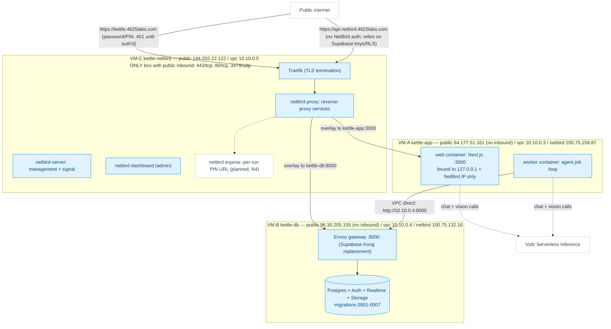

# Deployment

**Question:** What runs where on Vultr, and what's public?

**How to read it:**
- VM-C is the only box with public firewall rules (`fw-kettle-netbird`: 80/tcp, 443/tcp, 3478/udp); VM-A and VM-B firewalls allow no public inbound at all — SSH to them only works VPC-side, jumped through VM-C.
- Two separate NetBird reverse-proxy services front the two private VMs: `kettle.4625labs.com` → `kettle-app:3000` (password-gated) and `api.netbird.4625labs.com` → `kettle-db:8000` (ungated; Supabase's own keys/RLS protect it).
- The worker never goes through NetBird to reach the database — it uses the VPC directly (`10.10.0.4:8000`), which is faster and keeps the reverse proxy off the hot path for every job.
- `netbird expose` (dashed, N4) is planned but not implemented: NetBird's Peer Expose is enabled and the `netbird-proxy` container is running, but the worker doesn't yet request per-run ephemeral URLs.
- Web and worker both call Vultr Serverless Inference directly over the internet (outbound only, no inbound port needed for this).

**Sources:** `infra/README.md`, `infra/NETBIRD.md`, `docs/STATUS.md` (VM table), `web/docker-compose.yml`, `web/src/lib/agent/db.ts` (`SUPABASE_URL` VPC precedence), `docs/REQUIREMENTS.md` N4.
