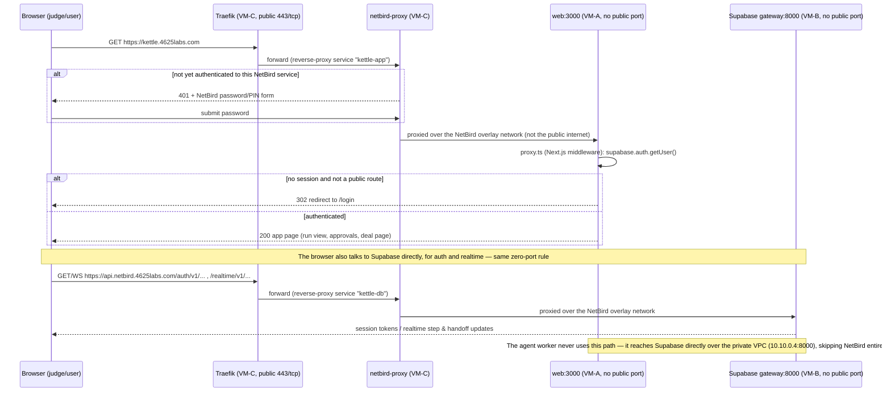

# Request Path

**Question:** How does a browser request reach the app with zero open ports?

**How to read it:**
- Only VM-C ever receives a public TCP connection; VM-A (the app) and VM-B (the database) have no listening public port at all.
- `kettle.4625labs.com` is gated by NetBird's own password/PIN screen (a `401` until solved) — that's the "human approval gate" in front of the Supabase login, not a replacement for it (N2).
- After NetBird auth, the request still has to pass Kettle's own Supabase session check in `proxy.ts`; the two logins are independent layers.
- The browser reaches Supabase's Auth and Realtime APIs the same way, via `api.netbird.4625labs.com` — never a direct port on VM-B (N3).
- The worker process is the one exception: it runs on VM-A and calls Supabase straight over the VPC (`SUPABASE_URL=http://10.10.0.4:8000`), because it doesn't need NetBird's public path at all.

**Sources:** `web/src/proxy.ts`, `infra/NETBIRD.md` (§3, §4), `infra/DEPLOYS.md`, `web/src/lib/agent/db.ts`, `docs/REQUIREMENTS.md` §7.7.
