# Technical Architecture

**Question:** Which runtime pieces talk to which (web, worker, queue, Realtime, inference)?

```mermaid
flowchart LR
    classDef sales fill:#DBEAFE,stroke:#2563EB,color:#1E3A8A
    classDef procurement fill:#EDE9FE,stroke:#7C3AED,color:#4C1D95
    classDef finance fill:#DCFCE7,stroke:#16A34A,color:#14532D
    classDef orchestrator fill:#F3F4F6,stroke:#4B5563,color:#111827
    classDef external fill:#FFFFFF,stroke:#9CA3AF,color:#374151,stroke-dasharray:4 3
    classDef vultr fill:#E0F2FE,stroke:#0284C7,color:#0C4A6E

    BROWSER["Browser"]:::external

    subgraph WEBPROC["web container (Next.js, port 3000)"]
        PROXY["proxy.ts: auth gate"]:::orchestrator
        UI["App Router pages: run view, approvals, deal page"]:::orchestrator
    end

    subgraph WORKERPROC["worker container: loop.ts"]
        LOOP["claim_job() poll, 4 concurrent slots"]:::orchestrator
        DISPATCH["dispatch.ts: JobKind -> handler"]:::orchestrator
        ORCH["orchestrator.ts: routeEvent() vs allow-list"]:::orchestrator
        SALES["Sales agent"]:::sales
        PROC["Procurement agent"]:::procurement
        FIN["Finance agent"]:::finance
        SIM["Sim-world: vendor personas, RFQ, dispute, payment"]:::external
        DOCS["Documents: render-pdf (pdftoppm), vision extract"]:::external
    end

    subgraph SUPABASE["Supabase (VM-B)"]
        AUTH["Auth (GoTrue)"]:::vultr
        RT["Realtime"]:::vultr
        PGDB[("Postgres: ledger, jobs queue, handoffs, approvals")]:::vultr
        STORE["Storage: invoices bucket"]:::vultr
    end

    LLM["Vultr Serverless Inference"]:::vultr

    BROWSER --> PROXY --> UI
    UI -->|"session"| AUTH
    UI -.->|"subscribe: agent_steps, handoffs, approvals"| RT
    UI -->|"authenticated read-only (RLS)"| PGDB

    LOOP -->|"rpc claim_job(worker_id)"| PGDB
    LOOP --> DISPATCH
    DISPATCH -->|"handoff.process"| ORCH
    DISPATCH -->|"vendor.rfq / vendor.dispute / customer.payment"| SIM
    ORCH -->|"allow-listed route"| SALES
    ORCH -->|"allow-listed route"| PROC
    ORCH -->|"allow-listed route"| FIN

    SALES -->|"emitHandoff -> enqueue"| PGDB
    PROC -->|"emitHandoff, requestApproval"| PGDB
    FIN -->|"emitHandoff, requestApproval"| PGDB
    PROC -->|"generateVendorInvoice"| DOCS
    FIN -->|"extractInvoice"| DOCS
    DOCS -->|"upload/download PDF"| STORE
    DOCS -.->|"vision: glm-5.3-flash"| LLM
    SALES -.->|"decide(): deepseek-v4.1-flash"| LLM
    PROC -.->|"decide(): deepseek-v4.1-flash"| LLM
    FIN -.->|"decide(): deepseek-v4.1-flash"| LLM
    SIM -.->|"persona text: laguna-s-2.1"| LLM
    PGDB -->|"0004 trigger: approvals -> approval.decided job"| LOOP
```

**How to read it:**
- The web process only ever *reads* the ledger with the user's own session (RLS `authenticated_read`); it never writes agent state directly — the worker (service role) is the sole writer.
- The worker is a plain poll loop (`claim_job()` every ~300 ms across 4 slots), not a message broker — Postgres itself is the queue.
- `dispatch.ts` fans out by job kind: handoffs go through the AI orchestrator's allow-list, RFQ/dispute/payment jobs go straight to Sim-world (no agent reasoning needed there).
- All three business agents call the same `decide()` helper against `deepseek-v4.1-flash`; vendor persona text uses the cheaper `laguna-s-2.1`; invoice extraction uses the vision model `glm-5.3-flash` on a `pdftoppm`-rendered PNG.
- A human deciding an approval doesn't call the worker directly — a Postgres trigger (0004) enqueues an `approval.decided` job that the same poll loop picks up, so resume logic goes through the identical job path as everything else.

**Sources:** `web/worker/loop.ts`, `web/src/lib/agent/dispatch.ts`, `web/src/lib/agent/orchestrator.ts`, `web/src/lib/agent/inference.ts`, `web/src/lib/documents/vision.ts`, `web/src/lib/sim/personas.ts`, `web/supabase/migrations/0002_agents_handoffs_auth.sql`, `web/supabase/migrations/0004_run_options_and_approval_jobs.sql`, `web/src/proxy.ts`.
