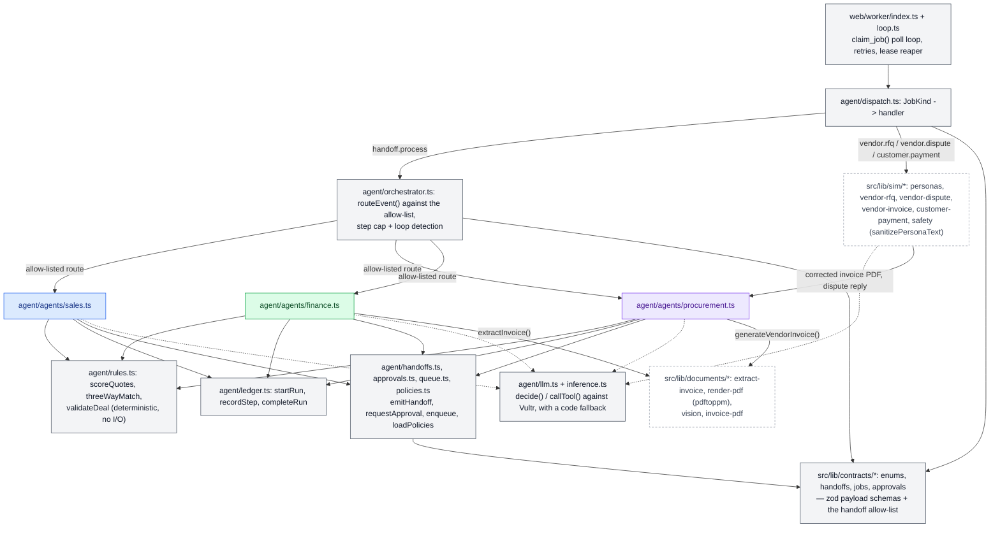

# Application Architecture

**Question:** How is the code organized (orchestrator, agents, sim, documents, contracts, ledger)?

**How to read it:**
- `contracts/*` is the shared vocabulary: every handoff and job payload is zod-validated against it, and the handoff allow-list here is the same one `orchestrator.ts` enforces at runtime (it throws at import time if they disagree).
- `rules.ts` holds every number Kettle computes — vendor scoring weights, 3-way match tolerance, deal validation — the model only ever explains or picks among options these functions already produced.
- The three agent files (`sales.ts`, `procurement.ts`, `finance.ts`) never import each other; they only reach one another indirectly, by writing a handoff row that the orchestrator later routes.
- Sim-world stands in for the outside world (vendors, customer) and hands corrected invoices and dispute replies back to Procurement — the only place business logic crosses from "simulated" back into "our agents".
- `documents/*` is Finance/Procurement's shared path to PDFs: Procurement generates vendor invoices, Finance extracts fields from them via the vision model.

**Sources:** `web/src/lib/contracts/*.ts`, `web/src/lib/agent/*.ts`, `web/src/lib/agent/agents/*.ts`, `web/src/lib/sim/*.ts`, `web/src/lib/documents/*.ts`, `web/worker/*.ts`.
