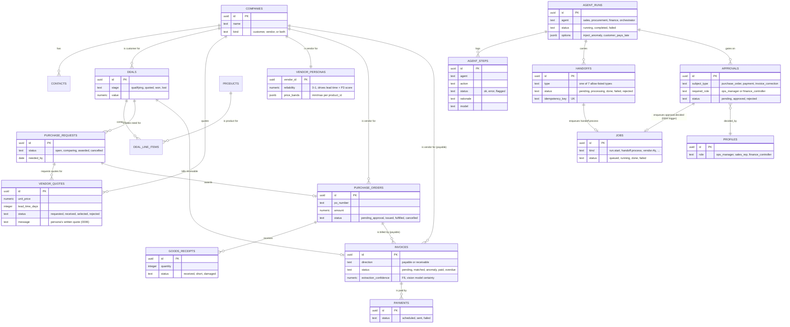

# Data Model

**Question:** What's in the shared ledger?

**How to read it:**
- Two parallel spines meet at `deals`: the sales/procurement/finance business ledger (top) and the agent execution trail (`agent_runs`/`agent_steps`/`handoffs`/`approvals`, bottom) that is the product's live UI, not a side log.
- `handoffs` and `approvals` don't call the worker directly — they only ever produce a `jobs` row (via `emitHandoff`'s own insert, or the `0004` trigger for approvals), and the worker's `claim_job()` is what actually resumes work.
- `purchase_orders` carries no unit price or quantity of its own; those live on the selected `vendor_quotes` row and the `purchase_requests` row (a deliberate join, not a gap).
- `invoices` is one table for both directions — `payable` (vendor bills) and `receivable` (customer bills) — distinguished by `direction`, which is why F2/F3 (payable) and F5 (receivable) share a status vocabulary.
- `handoffs.status` defines a `rejected` value in the schema, but no code path sets it today — only `vendor_quotes.status` actually reaches `rejected` (the losing quotes after vendor selection).

**Sources:** `web/supabase/migrations/0001_init.sql`, `0002_agents_handoffs_auth.sql`, `0004_run_options_and_approval_jobs.sql`, `0005_po_pending_approval.sql`, `0006_vendor_messages.sql`, `web/src/lib/contracts/enums.ts`, `web/src/lib/agent/entities.ts`.
