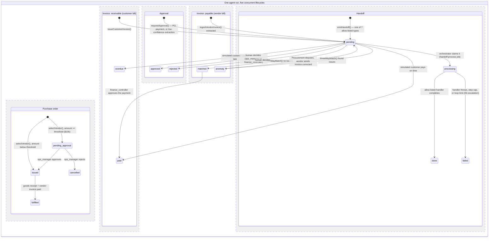

# States & Approvals

**Question:** How do POs, invoices, approvals, and handoffs change state?

**How to read it:**
- These five lifecycles run concurrently within one agent run — a single deal can have a PO in `pending_approval`, its payable invoice in `anomaly`, and its receivable invoice already `paid`, all at once.
- A PO's approval gate only fires above the policy threshold (default $10,000); below it, `issuePo()` runs immediately with no human step.
- The payable-invoice `anomaly → pending` loop is the demo's pushback moment: Finance hands the mismatch to Procurement, which disputes it with the vendor, and a corrected invoice re-enters at `pending` for another match attempt.
- Every payment requires a `finance_controller` decision no matter the amount — there is no low-value bypass, unlike the PO gate.
- `handoffs.status` also defines a `rejected` value in its check constraint, but no code path in the worker sets it today (only `vendor_quotes.status` reaches `rejected`, when a losing quote is passed over) — shown here only in the PO/invoice states where it's actually reachable.

**Sources:** `web/supabase/migrations/0001_init.sql`, `0002_agents_handoffs_auth.sql`, `0004_run_options_and_approval_jobs.sql`, `0005_po_pending_approval.sql`, `web/src/lib/agent/agents/procurement.ts`, `finance.ts`, `web/src/lib/agent/orchestrator.ts`, `web/src/lib/agent/approvals.ts`.
