# How We Built It

**Question:** How did the lead + parallel agents build and merge safely?

```mermaid
flowchart LR
    classDef human fill:#FEF3C7,stroke:#D97706,color:#78350F
    classDef external fill:#FFFFFF,stroke:#9CA3AF,color:#374151,stroke-dasharray:4 3
    classDef vultr fill:#E0F2FE,stroke:#0284C7,color:#0C4A6E
    classDef orchestrator fill:#F3F4F6,stroke:#4B5563,color:#111827
    classDef danger fill:#FEE2E2,stroke:#DC2626,color:#7F1D1D

    USER["User (solo developer)"]:::human
    LEAD["Lead session (Opus, main checkout)<br/>docs/**, merges, reviews"]:::orchestrator

    subgraph WORKTREES["Build agents — each its own git worktree + branch"]
        INFRA["infra (Sonnet) — agent/infra<br/>infra/**, Dockerfile, compose, /api/health"]:::vultr
        DATA["data (Sonnet) — agent/data<br/>supabase/**, contracts/**, types"]:::vultr
        FRONTEND["frontend (Sonnet) — agent/frontend<br/>app/**, components/**"]:::vultr
        AGENTSCORE["agents-core (Opus) — agent/agents-core<br/>worker/**, lib/agent/**, evals/**"]:::vultr
        SIMWORLD["simworld (Sonnet) — agent/simworld<br/>lib/sim/**, lib/documents/**"]:::vultr
        QADOCS["qa-docs (Haiku) — agent/qa-docs<br/>tests/**, README, ARCHITECTURE, DEMO"]:::external
    end

    GUARD["3 enforcement layers, every worktree:<br/>git hooks (pre-push, reference-transaction) +<br/>dead no-push:// remote, no creds +<br/>Claude Code deny rules (git push, gh, git remote, --no-verify, ...)"]:::danger

    MAIN[("local main")]:::orchestrator
    GITHUB["GitHub 4625Labs/kettle (private)"]:::external

    USER -->|"questions & decisions route here"| LEAD
    LEAD -->|"new-agent-worktree.sh + starting prompt"| WORKTREES
    WORKTREES -->|"hand-off summary, questions"| LEAD
    LEAD -->|"git diff main...agent/name, type-check, lint, build, then merge"| MAIN
    WORKTREES -.->|"git push --no-verify: still blocked"| GUARD
    MAIN -->|"lead-only: git push"| GITHUB
```

**How to read it:**
- Up to four build agents run at once, each in its own git worktree and branch (`agent/<name>`); only the lead session (the main checkout) ever merges into `main` or pushes to GitHub.
- Agents can commit to their own branch and pull `main` in with `git merge main`, but three independent layers stop them from pushing or touching `main` directly — even a deliberate `--no-verify` can't get past the dead `no-push://` remote and the missing credentials.
- Questions and decisions an agent can't make itself go up to the lead, not to the user directly — the lead is the single point that talks to the user.
- The roster ran in waves (infra/data/frontend first, agents-core/sim-world/frontend-phase-2 next, qa-docs last) so no more than about four branches were ever in flight, keeping merge review manageable.
- As of this snapshot, qa-docs (wave 3: README, `ARCHITECTURE.md`, `DEMO.md`, Playwright smoke test) hasn't started yet — everything else in the roster has been merged into `main`.

**Sources:** `docs/agents/README.md`, `docs/STATUS.md` ("Git" and "Resuming" sections), `scripts/` (`new-agent-worktree.sh`, `git-guards/`).
